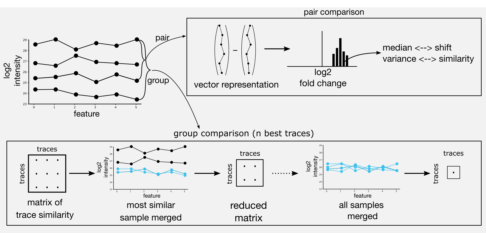
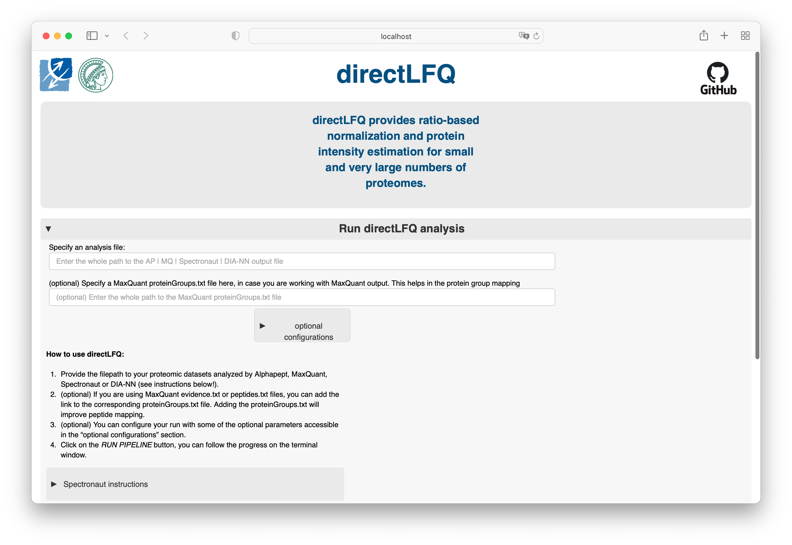

<!--  -->


<!-- [](https://pepy.tech/project/directlfq)
[](https://pepy.tech/project/directlfq)
[](https://pepy.tech/project/directlfq) -->


# directLFQ
directLFQ is an open-source Python package for quantifying protein intensities based on peptide intensities or fragment-ion intensities measured with from Mass Spectrometry-based proteomics. It preserves peptide ratios, shows very accurate quantification and has a robust normalization approach. Furthermore, it allows fast processing also of very large sample cohorts, as runtime increases linearly with sample number. It is part of the AlphaPept ecosystem from the [Mann Labs at the Max Planck Institute of Biochemistry](https://www.biochem.mpg.de/mann) and the [University of Copenhagen](https://www.cpr.ku.dk/research/proteomics/mann/).

You can process DIA and DDA data analyzed by [AlphaPept](https://github.com/MannLabs/alphapept), MaxQuant, FragPipe, Spectronaut and DIANN as well as [generic formats](#generic-input-format), using a Graphical User Interface (GUI) or the python package.


- [directLFQ](#directlfq)
  - [About](#about)
  - [Installation](#installation)
    - [One-click GUI](#one-click-gui)
    - [Developer](#developer)
  - [Running directLFQ](#running-directlfq)
    - [GUI](#gui)
    - [CLI](#cli)
    - [Python and Jupyter notebooks](#python-and-jupyter-notebooks)
  - [Troubleshooting](#troubleshooting)
  - [Citations](#citations)
  - [How to contribute](#how-to-contribute)
  - [License](#license)

---
## About
Generating protein intensities from Mass Spectrometry proteomics data comes with a variety of challenges. Differing peptides that belong to the same protein can have strongly differing intensities, for example due to differing ionization efficiencies. Missing values (i.e. peptides that have been detected in one run but not in the other) make simple summarization of peptide intensities to protein intensities problematic. Differences in sample loading can introduce systematic biases into the analysis.
With directLFQ, we provide a novel algorithm for addressing these challenges in an efficient and accurate manner. directLFQ retains peptide ratios and uses them to infer protein ratios and uses the concept of *intensity traces* for it's main processing steps. For futher details on the algorithm, please refer to the [publication](#citations).



---
## Installation

directlfq can be installed and used on all major operating systems (Windows, macOS and Linux).
There are currently two different types of installation possible:

* [**One-click GUI installer:**](#one-click-gui) Choose this installation if you only want the GUI and/or keep things as simple as possible.
<!---
* [**Pip installer:**](#pip) Choose this installation if you want to use directlfq as a Python package in an existing Python 3.8 environment (e.g. a Jupyter notebook). If needed, the GUI and CLI can be installed with pip as well.
-->
* [**Developer installer:**](#developer) Choose this installation if you are familiar with CLI tools, [conda](https://docs.conda.io/en/latest/) and Python. This installation allows access to all available features of directlfq and even allows to modify its source code directly. Generally, the developer version of directlfq outperforms the precompiled versions which makes this the installation of choice for high-throughput experiments.

### One-click GUI

The GUI of directlfq is a completely stand-alone tool that requires no knowledge of Python or CLI tools. Click on one of the links below to download the latest release for:

* [**Windows**](https://github.com/MannLabs/directlfq/releases/latest/download/directlfq_gui_installer_windows.exe)
* [**macOS**](https://github.com/MannLabs/directlfq/releases/latest/download/directlfq_gui_installer_macos.pkg)
* [**Linux**](https://github.com/MannLabs/directlfq/releases/latest/download/directlfq_gui_installer_linux.deb)

Older releases remain available on the [release page](https://github.com/MannLabs/directlfq/releases), but no backwards compatibility is guaranteed.

<!---
### Pip

directlfq can be installed in an existing Python 3.8 environment with a single `bash` command. *This `bash` command can also be run directly from within a Jupyter notebook by prepending it with a `!`*:

```bash
pip install directlfq
```

Installing directlfq like this avoids conflicts when integrating it in other tools, as this does not enforce strict versioning of dependancies. However, if new versions of dependancies are released, they are not guaranteed to be fully compatible with directlfq. While this should only occur in rare cases where dependencies are not backwards compatible, you can always force directlfq to use dependancy versions which are known to be compatible with:

```bash
pip install "directlfq[stable]"
```

NOTE: You might need to run `pip install pip==21.0` before installing directlfq like this. Also note the double quotes `"`.

For those who are really adventurous, it is also possible to directly install any branch (e.g. `@development`) with any extras (e.g. `#egg=directlfq[stable,development-stable]`) from GitHub with e.g.

```bash
pip install "git+https://github.com/MannLabs/directlfq.git@development#egg=directlfq[stable,development-stable]"
```
-->
### Developer

directlfq can also be installed in editable (i.e. developer) mode with a few `bash` commands. This allows to fully customize the software and even modify the source code to your specific needs. When an editable Python package is installed, its source code is stored in a transparent location of your choice. While optional, it is advised to first (create and) navigate to e.g. a general software folder:

```bash
mkdir ~/folder/where/to/install/software
cd ~/folder/where/to/install/software
```

***The following commands assume you do not perform any additional `cd` commands anymore***.

Next, download the directlfq repository from GitHub either directly or with a `git` command. This creates a new directlfq subfolder in your current directory.

```bash
git clone https://github.com/MannLabs/directlfq.git
```

For any Python package, it is highly recommended to use a separate [conda virtual environment](https://docs.conda.io/en/latest/), as otherwise *dependancy conflicts can occur with already existing packages*.

```bash
conda create --name directlfq python=3.8 -y
conda activate directlfq
```

Finally, directlfq and all its [dependancies](requirements) need to be installed. To take advantage of all features and allow development (with the `-e` flag), this is best done by also installing the [development dependencies](requirements/requirements_development.txt) instead of only the [core dependencies](requirements/requirements.txt):

```bash
pip install -e "./directlfq[development]"
```

By default this installs loose dependancies (no explicit versioning), although it is also possible to use stable dependencies (e.g. `pip install -e "./directlfq[stable,development-stable]"`).

***By using the editable flag `-e`, all modifications to the [directlfq source code folder](directlfq) are directly reflected when running directlfq. Note that the directlfq folder cannot be moved and/or renamed if an editable version is installed. In case of confusion, you can always retrieve the location of any Python module with e.g. the command `import module` followed by `module.__file__`.***

---
## Running directLFQ

There are three ways to use directlfq:

* [**GUI**](#gui)
* [**CLI**](#cli)
* [**Python**](#python-and-jupyter-notebooks)

NOTE: The first time you use a fresh installation of directlfq, it is often quite slow because some functions might still need compilation on your local operating system and architecture. Subsequent use should be a lot faster.

### GUI

If you have installed directlfq with the one-click GUI installer, you can run the GUI simply by clicking the directLFQ icon on your desktop/applications folder.

If the GUI was not installed through a one-click GUI installer, it can be activate with the following `bash` command:

```bash
directlfq gui
```

Note that this needs to be prepended with a `!` when you want to run this from within a Jupyter notebook. When the command is run directly from the command-line, make sure you use the right environment (activate it with e.g. `conda activate directlfq` or set an alias to the binary executable (can be obtained with `where directlfq` or `which directlfq`)).


### CLI


The CLI can be run with the following command (after activating the `conda` environment with `conda activate directlfq` or if an alias was set to the directlfq executable):

```bash
directlfq -h
```

It is possible to get help about each function and their (required) parameters by using the `-h` flag.


### Python and Jupyter notebooks

directLFQ can be imported as a Python package into any Python script or notebook with the command `import directlfq`.
Running the standard analysis (with plots) can be done via the command:
```bash
import directlfq.lfq_manager as lfq_manager

example_input_file_diann = "/path/to/example_input_file_diann.tsv"

lfq_manager.run_lfq(example_input_file_diann)
```

Several use cases for applying directLFQ can be found as Jupyter Notebooks in the tests folder. See for example the [quicktests notebook](tests/quicktests/run_pipeline_w_different_input_formats.ipynb).

---
## Troubleshooting

In case of issues, check out the following:

* [Issues](https://github.com/MannLabs/directlfq/issues): Try a few different search terms to find out if a similar problem has been encountered before
* [Discussions](https://github.com/MannLabs/directlfq/discussions): Check if your problem or feature requests has been discussed before.

---
## Citations

In the case that directLFQ is useful to you, please consider supporting us by citing (in preparation)

---
## How to contribute

If you like this software, you can give us a [star](https://github.com/MannLabs/directlfq/stargazers) to boost our visibility! All direct contributions are also welcome. Feel free to post a new [issue](https://github.com/MannLabs/directlfq/issues) or clone the repository and create a [pull request](https://github.com/MannLabs/directlfq/pulls) with a new branch. For an even more interactive participation, check out the [discussions](https://github.com/MannLabs/directlfq/discussions) and the [the Contributors License Agreement](misc/CLA.md).


---

## License

directLFQ was developed by the [Mann Labs at the Max Planck Institute of Biochemistry](https://www.biochem.mpg.de/mann) and the [University of Copenhagen](https://www.cpr.ku.dk/research/proteomics/mann/) and is freely available with an [Apache License](LICENSE.txt). External Python packages (available in the [requirements](requirements) folder) have their own licenses, which can be consulted on their respective websites.

